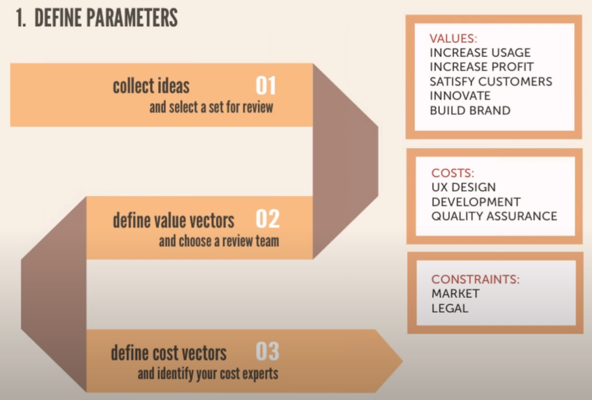
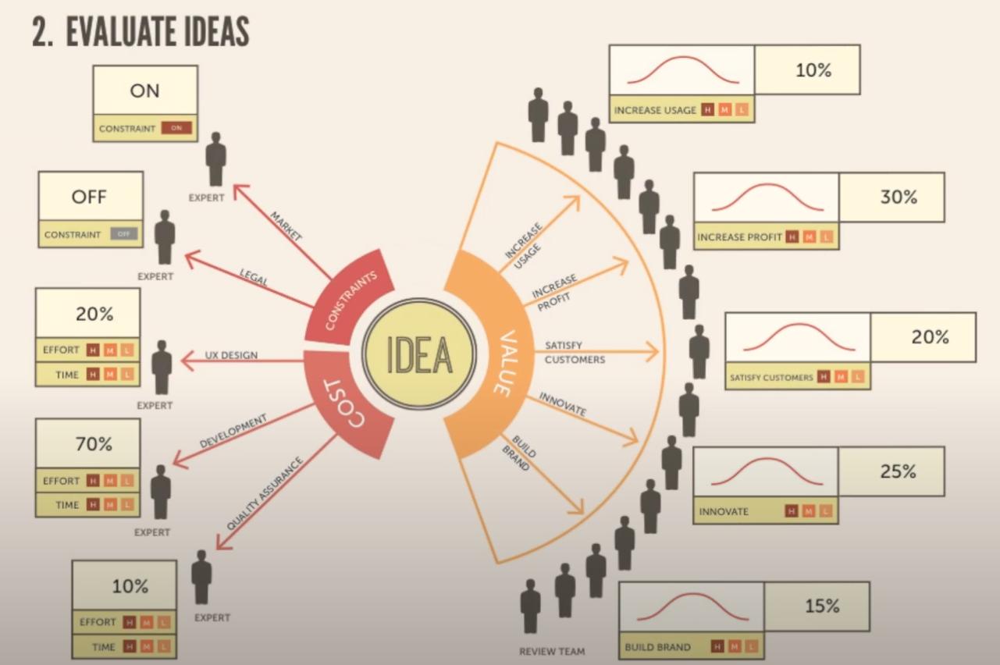
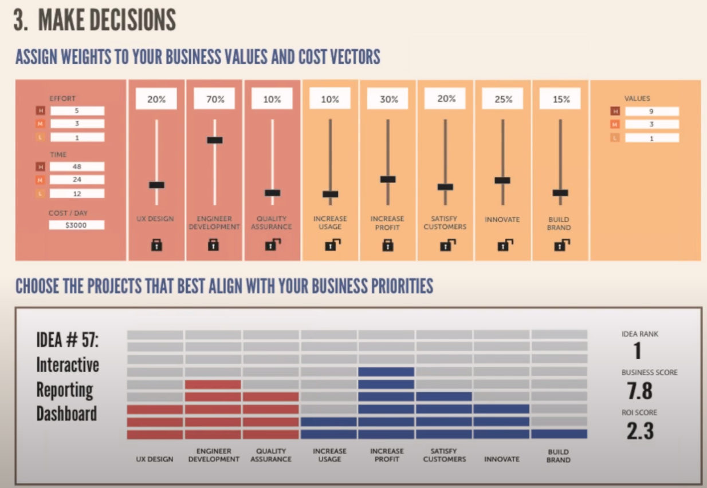
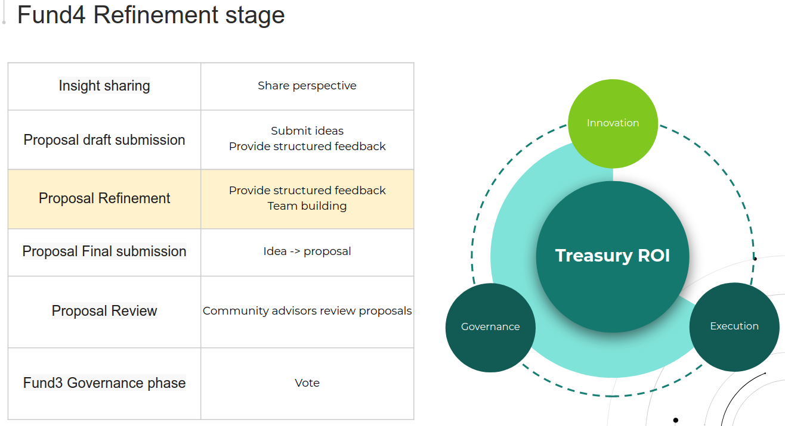

# DEEP Funding process and setup

## General process

## Catalyst workflow

## Proposed DEEP Funding process

Notes:
* expert-sourced decisions vs crowd-sourced decisions (for project selection);
* personas (who are personas of the process)
* we are sherpa -- the whole idea is to guide the users / community through the funnel from idea to implementation;
* proposers should be owners of the problem

## Software and implementation

## Resource considerations
